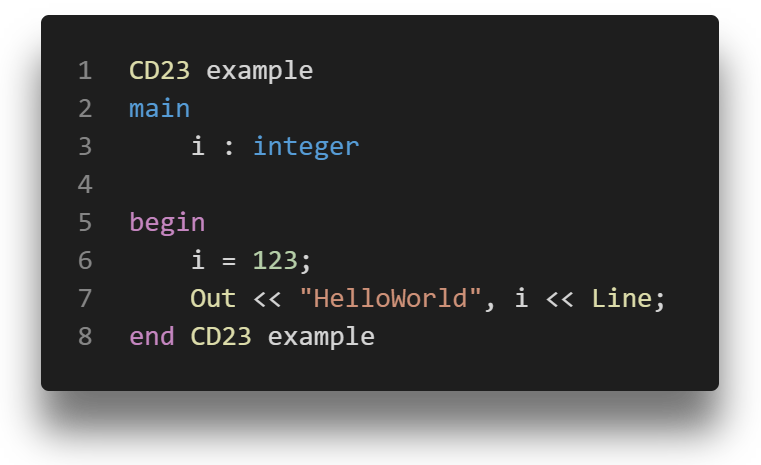

# CD23 Language Support

The CD23 extension adds language support for the COMP3290 CD23 source language to Visual Studio Code.

## Features

This extension adds basic syntax highlighting to CD23 files (denoted by the .cd extension). Tokens that are currenty highlighted are comments, operators, literals, strings and CD23 Keywords

## Release Notes

### v1.0.0
Initial release of the CD23 language extension support.
